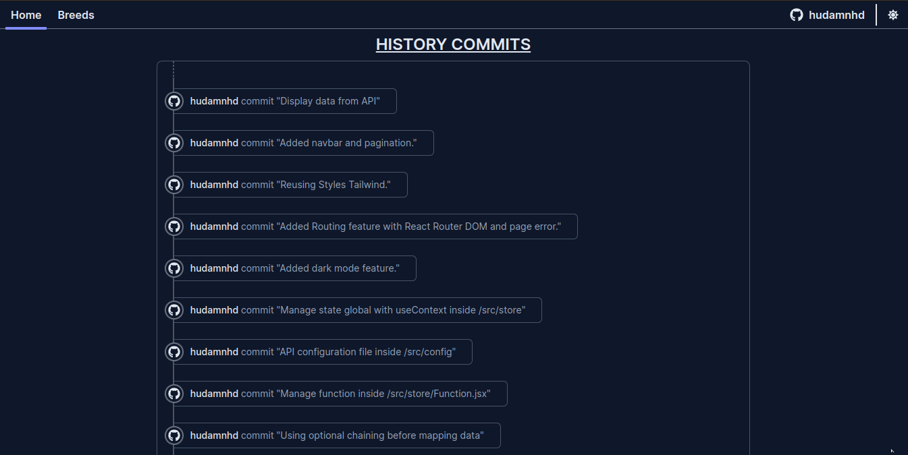
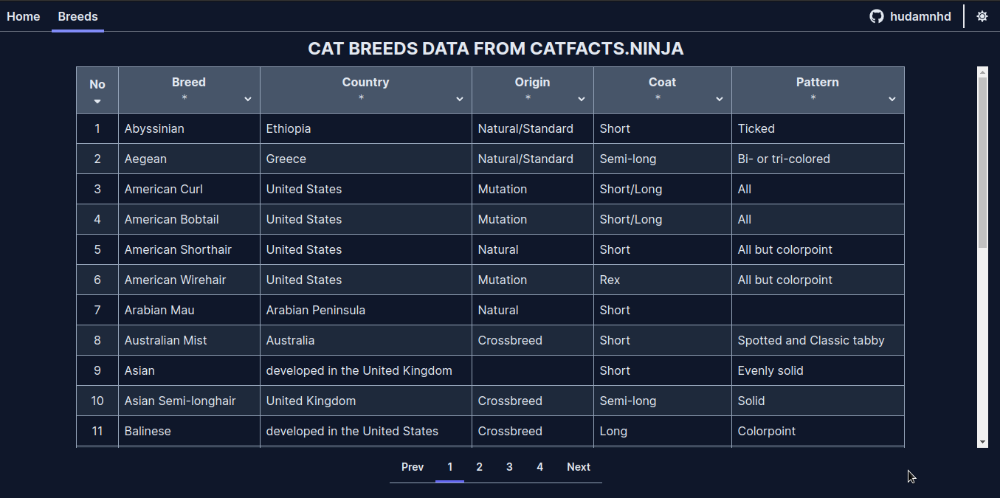

# Consume API from catfact.ninja

This is a single page application built with React and Tailwind

## Features

- Show data from API
- Filter data by Key
- Short data
- Manage global state inside /store directory
- manage config API inside /config directory
- Routing page by React router
- Dark mode

 
 

